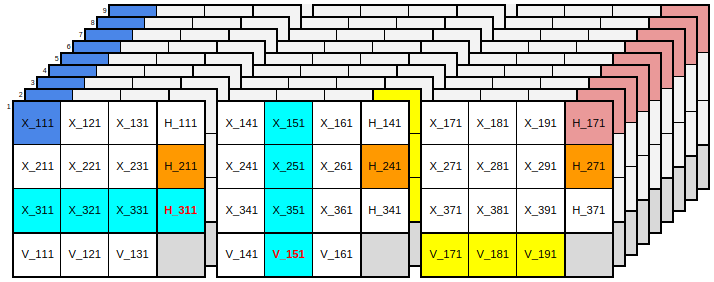
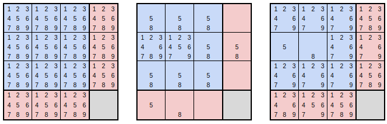
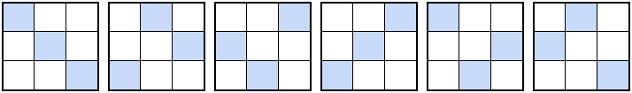

# SUDOKU IMPLEMENTATION

## Compilation Steps for basic solver using backtracking algorithm.
```
g++ -Wall -o basic_sudoku_solver basic_sudoku_solver.cpp
```
## Run the basic solver.
Firstly unzip the data.zip file
```
unzip data.zip
```
Run the basic sudoku solver.
```
./basic_sudoku_solver < data/puzzles0_kaggle
```
You can use any dataset present in the data dir.

## Impact of variable ordering

There is a considerable impact of variable ordering on backtracking efficiency. Before Peter Norvig ever wrote a Sudoku solver he first wrote the book, and you can read all about it there. So far we've paid no heed to which cell we're assigning next, and an obvious heuristic if we're going to be more deliberate about it is to pick from among the most constrained cells (i.e., those with the fewest remaining candidates) in order to reduce the effective branching factor of our search.

To achieve this, we'll add two functions and stick a call to ```MoveBestTodoTofront()``` at the top of ```SatisfyGivenPartialAssignment()```:
```
int NumCandidates(const RowColBox &row_col_box) {
    int [row, col, box] = cells_todo_[todo_index];
    auto candidates = rows_[row] & cols_[col] & boxes_[box];
    return NumBitsSet(candidates);
}

void MoveBestTodoToFront(int todo_index) {
    nth_element(cells_todo_.begin() + todo_index,
                cells_todo_.begin() + todo_index,
                cells_todo_.end(),
                [&](const RowColBox &cell1, const RowColBox &cell2) {
                    return NumCandidates(cell1) < NumCandidates(cell2);
                });
}
```

With these functions the  solver performance improves a bit, much better than bitmask backtracking solver. However, it still is far from the fast solvers present. It will take a lot of time(depending on hardware) to finish the dataset containing 1 million sudoku puzzles. You can test this by running
```
./basic_sudoku_solver < data/puzzles1_unbiased
```

## Compilation for bitmask backtracking solver.
```
g++ -Wall -o bitmask_solver sudoku_bitmask_backtracking.cpp
```
## Run
```
./bitmask_solver
```
## Compilation steps for DPLL triad simd solver.
```
g++ -Wall -g -fpic -fno-exceptions -fno-rtti simd_sudoku_main.cpp solver_dpll_triad_simd.cpp util.cpp -o simd_solver -lm -lstdc++
```
## Algorithm used

This algorithm needs understanding of propositional logic. It is quite advanced topic in mathematics and explaining this in detail would be out of scope of this document. Here is a bit of detail for enthusiasts. Please let me know if anyone is able to grasp this. It's always good to add knowledge to the empty ocean of my wisdom.

Suppose *xr<sub>cv</sub>* is a variable expressing that the cell at row *r* and column *c* contains the digit *v*, *D* is the set { 1,2,3,4,5,6,7,8,9 }, and R(i,j) and C(i,j) are functions returning the row and column respectively of the *j*th cell in the *i*th box. A minimal CNF formula representing the rules of Sudoku is a conjunction of the following clauses:

**Each cell contains a value** (81 positive clauses, 9 literals each)<br>

∀<sub>r,c∈D</sub> (x<sub>rc1</sub> ∨ x<sub>rc2</sub> ∨ x<sub>rc3</sub> ∨ x<sub>rc4</sub> ∨ x<sub>rc5</sub> ∨ x<sub>rc6</sub> ∨ x<sub>rc7</sub> ∨ x<sub>rc8</sub> ∨ x<sub>rc9</sub>)


**No row|col|box contains the same value twice** (3×81(<sup>9</sup><sub>2</sub>)=8748 binary constraint clauses)<br>

∀<sub>r,v,i,j∈D,i<j</sub> (¬x<sub>riv</sub> ∨ ¬x<sub>rjv</sub>)<br>
∀<sub>c,v,i,j∈D,i<j</sub> (¬x<sub>icv</sub> ∨ ¬x<sub>jcv</sub>)<br>
∀<sub>b,v,i,j∈D,i<j</sub> (¬x<sub>R(b,i)C(b,i)v</sub> ∨ ¬x<sub>R(b,j)C(b,j)v</sub>)<br>

These 8829 clauses capture the necessary constraints common to all Sudoku puzzles. The basic solver described above effectively takes these as its starting point, along with one other set of obvious (though strictly speaking redundant) clauses:<br>

**No cell contains more than one value** (81(<sup>9</sup><sub>2</sub>)=2916 binary constraint clauses)<br>
∀<sub>r,c,i,j∈D,i<j</sub> (¬x<sub>rci</sub> ∨ ¬x<sub>rcj</sub>)

In addition to these general constraints, we express the additional constraints of a specific puzzle by adding a unit clause for each of the given clues. For example, to represent the previous sample input:<br>
```
5.....37....6..............7..54.....4......2...1..6...6..83........2.4...1......
```
We add these unit clauses:<br>

(x<sub>115</sub>) ∧ (x<sub>173</sub>) ∧ (x<sub>187</sub>) ∧ (x<sub>246</sub>) ∧ (x<sub>417</sub>) ∧ (x<sub>445</sub>) ∧ (x<sub>454</sub>) ∧ (x<sub>524</sub>) ∧ (x<sub>592</sub>) ∧ (x<sub>641</sub>) ∧ (x<sub>676</sub>) ∧ (x<sub>726</sub>) ∧ (x<sub>758</sub>) ∧ (x<sub>763</sub>) ∧ (x<sub>862</sub>) ∧ (x<sub>884</sub>) ∧ (x<sub>931</sub>)

With our problem expressed as a propositional formula in CNF we can now turn to DPLL for a solution. What is DPLL? The Davis-Putnam-Logemann-Loveland algorithm is the Kevin Bacon of satisfiability. There are shinier things, but he's been around for a long time, everyone has worked with him, and in the right role he still gets the job done. (Duck anyone?) DPLL determines whether a CNF formula, F, is satisfiable (and finds a satisfying truth assignment) by pairing search with restricted constraint propagation in the form of unit resolution. In a nutshell, the algorithm is this:<br>

***DPLL(F):***<br>
***F←unit-propagate(F)***<br>
***if (contains-empty-clause(F))return UNSAT***<br>
***if (contains-consistent-interpretation(F))return SAT***<br>
***lit←choose-literal-to-branch(F)***<br>
***return DPLL(F ∧ {lit}) ∨ DPLL(F ∧ {¬lit})***<br>

If you squint at it hard enough, you'll see that the behaviour of our heuristic simple solver is the same as that of DPLL. Its representation of clauses is implicit rather than explicit, but it does return false when there are no candidates for a cell (when the cell's positive clause has become empty); it does return true when a satisfying assignment for all cells is found; it does do unit propagation (if the last assignment caused another cell to have just one candidate then this cell will be processed next); and it does effectively branch on literals (since cell values are mutually exclusive asserting the next candidate is the same as negating the first and then choosing another literal to branch). Given this correspondence, in what follows we'll abandon the crypto-DPLL and speak in terms of DPLL directly.

Now the core of DPLL, and the key to understanding its limitations, is the unit propagation step, so let's examine this more closely.

Recall the resolution rule in propositional logic, which says we can take a pair of clauses, one containing a literal x and the other containing its negation ¬x, and combine them to produce a third clause, the resolvent, containing the union of the literals in the first two clauses minus the complementary literals resolved upon.

To motivate this, we can take an arbitrary pair of resolvable input clauses:

(x ∨ y<sub>1</sub> ∨…∨ y<sub>n</sub>)(¬x ∨ z<sub>1</sub> ∨…∨ z<sub>n</sub>)<br>

And rewrite them as implications:<br>

¬x→(y<sub>1</sub> ∨…∨ y<sub>n</sub>) x→(z<sub>1</sub> ∨…∨ z<sub>n</sub>)

By the law of the excluded middle we know we must have (¬x∨x), so we must have one or the other of these consequences:<br>

(y<sub>1</sub> ∨…∨ y<sub>n</sub>) ∨ (z<sub>1</sub> ∨…∨ z<sub>n</sub>)

Which we can write simply as:<br>

(y<sub>1</sub> ∨…∨ y<sub>n</sub> ∨ z<sub>1</sub> ∨…∨ z<sub>n</sub>)

Resolution gives us a sound procedure for finding consequences, and if we exhaustively perform all possible resolutions we'll eventually find all consequences, including the puzzle solution in the form of a unit clause for each cell. This will do away with the need for any search, guessing, or backtracking, but it will also produce a fantastic number of consequences along the way, most of which are not required in the resolution derivation of our solution; our solver will be slow.

Going in the other direction, we've already seen with our first basic solver that if we omit constraint propagation and just perform search then we wind up with a truly excessive amount of guessing and backtracking; again our solver will be slow.

The winning compromise of DPLL is to use constraint propagation to prune the search tree, but to restrict the inference done during constraint propagation to keep it bounded and fast, if incomplete. In particular, in the constraint propagation step of DPLL we perform resolution, but we confine ourselves to resolutions between pairs of clauses where at least one of the parent clauses is a unit clause (i.e., a literal already known to be asserted). Since the resolvent in this case always subsumes its non-unit parent, the size of our formula can only shrink. This nicely bounds the cost of constraint propagation, but it does mean we'll fail to find any consequences not reachable via unit resolution.

To illustrate a consequence we won't find, after unit propagation the first row of a puzzle might have the following assigned cells and remaining candidates in unassigned cells:<br>
<br>
                                  


It will be obvious to a human player that the solutions to the cells in the center and on the right are 2 and 8 respectively because these are hidden singles; but this conclusion can not be reached via unit resolution from our starting formula simply because there are no unit clauses to work with. The clauses relevant to the deductions we want to make are all binary constraint clauses or positive cell clauses that now contain 2, 3, or 4 literals.

Fortunately there's an easy fix for this specific problem. All we need to do is add some new positive clauses that are group-aligned instead of cell-aligned:

**Each row contains each value in some column** (81 positive clauses, 9 literals each)<br>
∀<sub>r,v∈D</sub> (x<sub>r1v</sub> ∨ x<sub>r2v</sub> ∨ x<sub>r3v</sub> ∨ x<sub>r4v</sub> ∨ x<sub>r5v</sub> ∨ x<sub>r6v</sub> ∨ x<sub>r7v</sub> ∨ x<sub>r8v</sub> ∨ x<sub>r9v</sub>)

**Each column contains each value in some row** (81 positive clauses, 9 literals each)<br>
∀<sub>c,v∈D</sub> (x<sub>1cv</sub> ∨ x<sub>2cv</sub> ∨ x<sub>3cv</sub> ∨ x<sub>4cv</sub> ∨ x<sub>5cv</sub> ∨ x<sub>6cv</sub> ∨ x<sub>7cv</sub> ∨ x<sub>8cv</sub> ∨ x<sub>9cv</sub>)

**Each box contains each value in some cell** (81 positive clauses, 9 literals each)<br>
∀<sub>b,v∈D</sub> (x<sub>R(b,1)C(b,1)v</sub> ∨ x<sub>R(b,2)C(b,2)v</sub> ∨…∨ x<sub>R(b,8)C(b,8)v</sub> ∨ x<sub>R(b,9)C(b,9)v</sub>)

Armed with these new positive clauses unit resolution can discover and propagate hidden singles since these clauses will become unit clauses when only one candidate remains in a group.

In a sense these clauses haven't added anything new. Like the no-cell-contains-two-values constraints they are all logical consequences of the minimal clause set we started with, and we could derive a resolution proof for each of them if we were patient. That said, we know these new clauses are consequences of the minimal clause set not because of resolution proofs, but because of the pigeonhole principle. And since the shortest resolution proof of a pigeonhole formula is exponential in the number of variables [Haken 1985], these new clauses are, in a sense, very very far away from our starting point. It's therefore no surprise that puzzles which require them (e.g., 17 clue puzzles) are very difficult for solvers that are not designed to take advantage of them.

Note that we might easily have included these clauses from the start. They are, after all, the positive side of the "exactly one" rule. The main reason why we didn't is that we started by thinking not in terms of clauses and literals, but in terms of an implementation focused on cells and their candidates. This makes it natural to consider only the positive clauses representing candidates for a cell, not those that go across cells. It is probably also why many Sudoku solvers treat naked singles and hidden singles as different things, if they take hidden singles into consideration at all.

## The Tseytinesque Transformation
While the cost of unit propagation is bounded by the number and size of the clauses in our formula, we've just seen that this doesn't mean we want to strictly minimize the size of this formula. It can be quite useful to add clauses that are tautologically implied if they make consequences reachable via unit resolution that were not reachable before.

This raises an important question: what other clauses would it help to add?

There exist a range of knowledge compilation techniques whose purpose is to augment a logical formula with consequences found during an offline analysis phase so that the augmented formula supports complete inference with respect to a tractable procedure like unit resolution [Cadoli 1997]. If it were feasible for Sudoku we'd be happy to exchange an expensive one-time compilation for a representation that gives us fast and complete inference while puzzle solving. Unfortunately, judging just from the pigeonhole issues already discussed, it is almost certainly infeasible perform such a compilation for Sudoku, or it would produce a compiled theory much too large to be practical.

However, a key insight discussed in [del Val 1994] is that the incompleteness of unit resolution is tied to the occurrence of merges in resolution proofs. By a merge we mean a case where the resolvent contains one or more literals that occurred in both parent clauses, as in the following example where we have a merge on b.

(a ∨ b ∨ c) ∧ (¬a ∨ b ∨ d) / (b ∨ c ∨ d)

This observation motivates del Val's compilation technique which augments a CNF formula with a subset of its merge prime implicates in a way that guarantees all other prime implicates can be reached during a unit resolution refutation.

Following this line of thinking, if we're looking for clauses that would be useful to add to our Sudoku formula we should start by looking for common consequences that arise via merge resolutions. Where, then, can merges arise?

They can not arise from any combination of binary constraint clauses exclusively. These clauses contain only negative literals and produce no resolutions on their own.

They can not arise from the conjunction of binary constraint clauses and any single positive cell clause. A non-tautological resolution involving the positive cell clause exchanges one of its positive literals for a negative literal of the same value in a different cell. Since the possible substitutions for each positive literal are all disjoint, again no merges can occur.

However a merge can arise from the conjunction of binary constraint clauses and any of the group positive clauses that we added to support hidden singles.

For example, if we start from the clause asserting there's a one in the first row and assume that we've eliminated the possibility of a one in all cells except the intersection with the first box, then we're left with what we'll call a **triad:** a disjunction over three literals for the same value in an intersection:

(x<sub>111</sub> ∨ x<sub>121</sub> ∨ x<sub>131</sub>)

Looking at the first cell on the second row, we have among our binary constraints these clauses:

(¬x<sub>111</sub> ∨ ¬x<sub>211</sub>)<br>
(¬x<sub>121</sub> ∨ ¬x<sub>211</sub>)<br>
(¬x<sub>131</sub> ∨ ¬x<sub>211</sub>)<br>

A series of merge resolutions between these clauses results in the unit consequence that the cell on the second row can not contain a one:

(¬x<sub>211</sub>)<br>

In Sudoku circles the situation described above is known as a "locked candidate". i.e., we don't know which cell contains the candidate, but we do know that it's one of the three cells in the intersection, and therefore the candidate can be excluded from any other cells in the groups that contain the intersection. I don't know if locked candidates play an especially important role in human puzzle solving relative to the many other puzzle solving techniques, but their consideration of does appear to play an important role in fast sudoku solvers. They probably have a large payoff precisely because they are the simplest and most common cases where merge resolutions arise to thwart unit propagation.

What, then, is the clause we should add to make the inference above available via unit resolution? In this case it would be:

(x<sub>141</sub> ∨ x<sub>151</sub> ∨ x<sub>161</sub> ∨ x<sub>171</sub> ∨ x<sub>181</sub> ∨ x<sub>191</sub> ∨¬x<sub>211</sub>)

With 54 intersections, 12 cells that pivot around each, and 9 values we would need 5832 clauses of 7 literals each to represent all cases like this, which seems quite a lot. Adding such a large number of large clauses would almost triple the size of our formula. Fortunately, there is a better way.

Observing that the triads we've defined above are common subexpressions between box-oriented positive clauses and row or column-oriented positive clauses, we can factor our logic by introducing a new propositional variable to represent the satisfiability of each triad. We separately define horizontal and vertical triads, here indexed respectively by the lowest column or row they contain:

∀<sub>r,v∈D,b∈{1,4,7}</sub>h<sub>rbv</sub> ↔ (x<sub>r(b+0)v</sub> ∨ x<sub>r(b+1)v</sub> ∨ x<sub>r(b+2)v</sub>)
∀<sub>c,v∈D,b∈{1,4,7}</sub>v<sub>bcv</sub> ↔ (x<sub>(b+0)cv</sub> ∨ x<sub>(b+1)cv</sub> ∨ x<sub>(b+2)cv</sub>)

After adding these definitions to our formula we can replace our 9-literal positive row, column, and box clauses with 3-literal clauses over triads. Further, we can replace most of our group-aligned binary constraint clauses with binary constraints involving triads. e.g., we replace an exactly-one row constraint over cell literals:

exactly-one (x<sub>r1v</sub> ∨ x<sub>r2v</sub> ∨ x<sub>r3v</sub> ∨ x<sub>r4v</sub> ∨ x<sub>r5v</sub> ∨ x<sub>r6v</sub> ∨ x<sub>r7v</sub> ∨ x<sub>r8v</sub> ∨ x<sub>r9v</sub>)

With three exactly-one constraints that define horizontal triads:

exactly-one (x<sub>r1v</sub> ∨ x<sub>r2v</sub> ∨ x<sub>r3v</sub> ∨ ¬h<sub>r1v</sub>)<br>
exactly-one (x<sub>r4v</sub> ∨ x<sub>r5v</sub> ∨ x<sub>r5v</sub> ∨ ¬h<sub>r4v</sub>)<br>
exactly-one (x<sub>r7v</sub> ∨ x<sub>r8v</sub> ∨ x<sub>r9v</sub> ∨ ¬h<sub>r7v</sub>)<br>

And one exactly-one constraint to re-express via triads that we have exactly one value in the row:

exactly-one (h<sub>r1v</sub> ∨ h<sub>r4v</sub> ∨ h<sub>r7v</sub>)

This replaces one 9-literal clause and 36 binary clauses with one 3-literal clause, three 4-literal clauses, and 21 binary clauses.

This procedure is very much like applying a Tseytin transformation with the goal not of putting our formula into CNF -- we already have CNF -- but rather to eliminate the need for merges. Our new formula has extra nuisance variables that are not directly a part of our solution, but the overall formula is equisatisfiable with the original, it is smaller than the original, and it makes more consequences reachable by unit resolution than does the original.

##Cardinality Constraints
The introduction of triads is a nice improvement in our representation, but there is more we can do with them. So far we've used them to express constraints that act on the same value across intersections in a group. We can also use them to express constraints over different values within the same intersection. However, to do this it will be convenient to think of our clausal representation and resolution rule a little differently.

A disjunction is a way of saying "at least one of the literals in this set true". This can be seen as a special case (with c=1) of a more general cardinality constraint expressing that at least c of the literals are true; and the cardinality constraint in turn can be seen as a special case (with all w=1) of a more general linear pseudo-boolean constraint expressing an inequality over a weighted sum of literals:

∑<sub>i</sub>w<sub>i</sub>l<sub>i</sub> ≥ c with w<sub>i</sub>, c∈Z and l<sub>i</sub> a literal, x, or its negation x¯ (i.e. ¬x).

Previously we justified resolution by converting clauses into implications and showing via the law of the excluded middle that we must have one or the other of the right hand sides of those implications. For pseudo boolean constraints we can perform inference in a similar way by adding together two equations and appealing again to the law of the excluded middle to simplify using the identity x+x¯=1.

For instance, starting with:
2x+y¯+z ≥ 2y ≥ 1
 
We obtain:

2x+y¯+y+z ≥ 32x+z ≥ 2

From which we can conclude x since the inequality can not be satisfied using z alone if x is false.

As illustrated by this example, there are some additional complexities to simplifying general pseudo boolean constraints. However, this need not concern us since we'll only need cardinality constraints. These play nicely with unit resolution, so the additional power of this representation essentially comes at zero cost. We can view each cardinality constraint as a clause equipped with a minimum other than one. When the number of literals remaining equals the clause minimum, then we can assert each of the literals as a unit clause.

With this tool we now have an easy way to represent and reason about the triad literals in a given interection. An intersection contains three cells and each cell has one value, so what we want to say is:

exactly-three (h<sub>111</sub> ∨…∨ h<sub>119</sub>)

The usual way to express this in CNF would be to add (97)=36 clauses to insist on at least 3 values and (94)=126 clauses to insist on at most 3 values. Instead, we can write this with just two cardinality constraints:

h<sub>111</sub> +…+ h<sub>119</sub> ≥ 3
h¯<sub>111</sub> +…+ h¯<sub>119</sub> ≥ 6

This is a much more compact and tidy representation, which we appreciate since the cost of unit propagation is bounded by the size of our representation, and since our efforts to implement this efficiently will be intimately tied to our representation.

## The Representational Reward
Enough of the theory for a moment. Let's put this ideas into practice and see how far we've come.

Our next solver will be based on DPLL with literals and cardinality constraints as the native representation. The logic will be organized around triads as discussed above. The diagram below offers a visualization of the propositional variables involved in a single band and the ways in which literals occur together in each type of constraint:<br>
<br>
            


There's a separate layer in the diagram for the literals for each digit. To help make relationships clear each box is depicted separately, containing a 3x3 matrix of cell literals as well as 3x1 and 1x3 vectors of horizontal and vertical triads. The colored regions indicate sets of literals that occur together in exactly-N constraints of each type:

The blue literals (starting with X_111) form an exactly-one constraint indicating that the cell at R1C1 has exactly one value.
The reddish triad literals (starting with H_171) form an exactly-three constraint indicating that the intersection containing cells R1C7,R1C8,R1C9 has exactly three values.
The horizontal row of cyan literals (starting with X_311) form an exactly-one constraint establishing the definition of the H_311 triad literal (shown in red to indicate that its occurrence in this clause is negative).
The vertical row of cyan literals (starting with X_151) form an exactly-one constraint establishing the definition of the V_151 triad literal (shown in red to indicate that its occurrence in this clause is negative).
The horizontal row of yellow literals (starting with V_171) form an exactly-one constraint indicating that one and only one of the value one may occur in the box. The vertical column of yellow literals in the second layer establishes the same constraint for a different box for the value two. Note that these horizontal and vertical within-box constraints are in some sense redundent, but still valuable as discussed above.
The set of non-contiguous orange literals (starting with H_211) form an exactly-one constraint indicating that one and only one of the value one may occur in the row. Note that there are similar constraints oriented vertically across boxes, but they're not shown here because we're only looking at one horizontal band.
Note that we have no constraint directly involving all of the cell literals in a row, column, or box. These constraints are all mediated via triads.

## Strongly Connected Components
So far we've spent a lot of time discussing unit resolution since this is at the heart of DPLL. However, unit resolution is not the only tractable form of propositional inference. Certainly the inference is bounded if our clauses must shrink, but it is also bounded if our clauses can't grow, a criterion that is also met if we restrict attention to binary clauses. It's worth noticing that the majority of our clauses are binary to begin with, and after the introduction of triads most of our other clauses are just one or two eliminations away from being binary. This hints that a substantial part of our reasoning can take place in the implication graph formed by just our binary clauses, a hint corroborated by the fact that a large fraction of advanced human puzzle solving strategies involve looking for cycles in exactly this graph.

To explore what we can do here, we'll first update our unit propagation procedure to keep track of the binary clauses encountered during elimination. Each non-subsumed binary clause produces two binary implications, since a∨b can be written as ¬a→b or as ¬b→a, and these implications create a directed graph among our literals.

Once unit propagation reaches a fixed point, but before making any guesses, we'll run a strongly connected components algorithm on our binary implication graph. There are several DFS-based SCC algorithms that are linear-time like unit propagation itself. This will find the condensation graph, a DAG of strongly connected components, where each component is a clusters of literals that mutually imply each other. It will also return the components in topological order.

Finding these SCCs will assist us in a couple of ways:

If we find a component that contains both a literal L and its negation ¬L, then we are already in an inconsistent state and we can backtrack immediately without further search.
If, during DFS, the algorithm encounters a literal that is a consequence of its negation (and not vice-versa), then that literal can be immediately asserted.
Once we've found the SCCs we can use both the size of the components and their position in the topological order to determine the best literal to branch on next. i.e., it's beneficial to branch on a literal in a large component early in the topological order because reduces the remaining search space to the greatest extent has has the most consequences.
From the standpoint of human puzzle solving techniques, our method of finding SCCs should allow the solver to exploit naked and hidden doubles as well as a variety of coloring and chaining methods.
    
## Getting Vectorized
In the interest of speed we'll set aside the strongly connected components and focus exclusively on how to represent our cardinality constraints and triads in a way the supports efficient inference. In fact, we've already had a preview of how this can be done in the diagram above that depicts our propositional variables and their co-occurrence in clauses.

Briefly, we'll organize our representation of state and our inference procedure around two concepts: the box and the band. Each of these will have it own method of elimination and update, and we'll batch- propagate inference between boxes and bands via message passing between peers.

For boxes we've seen above that it's convenient to organize the positive cell literals and negative triad literals of a box as a 4x4 matrix with one unused extra cell. This gives a compact way to organize 3 out of our 5 varieties of cardinality constraint (1/9 positive cell clauses, 6/9 negative triad clauses, and 1/4 triad definition clauses). We'll store the box state in a 256-bit SIMD vector of packed 16-bit integers. Each 16-bit integer will store 9 bits representing candidate layers in the diagram above, with the top 7 bits unused. For platforms lacking AVX2 support we'll wrap two __m128i in a vector class.5

This representation allows lets us use vector instructions to perform all eliminations within a box at once when assigning one or more digits to cells in that box. For example, in the diagram below the first matrix represents the initial state of a box with an empty board. All candidates are possible for each cell and negative triad. The second matrix is a mask representing eliminations that follow from the placement of a 5 and an 8 in the first two cells of the second row. Note that the placement of a value in a cell rules out negative triads in the corresponding rows and columns. The third matrix shows the state of the box after application of the mask with a single SIMD instruction.<br>
<br>
         


For this whole scheme to be efficient it's important that we operate on vectors as much as possible. The moment we start inspecting individual elements of the vectors we face major performance losses. So to make this work we need to be able to do a few interesting things, including:

computing a vector popcount which takes a vector and returns a vector whose elements contain the number of bits set in the corresponding elements of the input vector.
determining via a sequence of row and column rotations whether a triad definition clause is triggered
constructing an elimination mask for an arbitrary set of triggered cells and values.
None of these are as simple or as cheap as the straightforward vector operations of eliminating candidates, but they are all feasible and they can all be done without branches.

Given our box representation it falls to the bands to represent the remaining two varieties of cardinality constraint, both of which involve only positive triad literals (1/3 clauses horizontally and vertically for each value within the band, and 3/9 clauses across values for each intersection).

For the bands we could follow the same basic scheme we used for the boxes, in which case we would use 9 16-bit cells of another 256-bit vector to represent the clauses. However, this proves to be overkill. For a given value the band contains 9 triads, so on one level there are 29 possible combinations of truth values these can assume. However, due to our horizontal and vertically-oriented exactly-one constraints, there are really only 6 configurations that the triads can take.<br>
<br>
       

To take advantage of this we'll introduce another set of propositional variables representing these 6 configurations, and our representation of band state will be a 6-element vector indicating which values can take which configurations.

With the previous introduction of triads we were able to both simplify our logic and make new consequences reachable via unit resolution. In this case we only achieve the first of those goals since all of the relevant consequences were already reachable. However, by reasoning first with configurations instead of triads we're able to do in what step what previously might have required multiple steps within the band.

There are more details, but it'll be better to read the code than to read about it here.

There's one other thing worth mentioning. Our representation of bands and boxes affords a number of choices when it comes to initializing the state of the puzzle and to heuristics for guessing. In both cases it's proved fastest to come at things from the perspective of bands first.

When initializing the puzzle instead of applying the clues once cell at a time, or even batch applying the clues one box at a time, it turns out to be best to construct 6 band elimination messages from all of the clues, and then apply and propagate these 6 messages in turn.

When determining the next guess to make instead of finding the most constrained cell or box, it turns out to be best to find the band with the fewest possible configurations across all values, and then to branch on the value that has the fewest configurations in the band.

OK! Enough talk. If you've read all this I'm impressed! Time for some results.

## The Fast SIMD Solver
At long last it appears that our dpll-triad-simd solver compares quite favorably to other state-of-the-art solvers on hard puzzles! Compared to the geometric mean performance of the other solvers it's ~50% faster on the magictour dataset, and relatively speaking it gets even faster as the datasets get harder, approaching 2x as fast on the hardest_1106 dataset!
